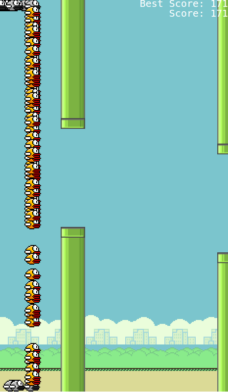

    

# Flappy Bird AI

Flappy bird ai is a code that plays flappy bird automatically.

The language of flappy bird is javascript and you can run this program easily from yourcomputer.

## how to use

To run this code, you need to run main.html by clicking on it or opening the folder from your browser.

To make it run faster, keep pressing.

## how does it works

This AI is learns using algorithm called GA (genetic algorithm).

Explaing too far will make this too long so search it if you wanna know how it works.

By the way, this is my first AI I code so I tell me if there is a better way to make it work better.